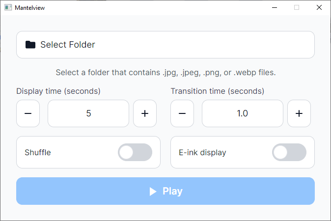

# Mantelview

A cross-platform fullscreen image slideshow for desktop digital picture frames and smart home kiosk displays. Shuffles properly with random order every cycle. Download one binary, point it at a folder of images, and press Play.



## What Is This For

Mantelview is for anyone who wants a dedicated image slideshow without assembling a toolchain. It ships as a single self-contained executable with a GUI launcher, so setup is: extract, run, choose a folder, press Play. It works on a Windows desktop, a Debian workstation, or a Raspberry Pi connected to a TV on your mantelpiece.

If you need advanced features like EXIF-based playlists, cloud sync, or MQTT device integration with Home Assistant, dedicated tools are a better fit. Mantelview keeps things simple on purpose.

## Features

- **Extract and run** — a single self-contained binary with no runtime to install. Download, extract, double-click.
- **Cross-platform** — one app for Windows 10/11 x64, Debian 12+ x64, and Raspberry Pi OS Bookworm ARM64.
- **GUI launcher** — select a folder, set display time, pick shuffle or in-order, and press Play.
- **Configurable transition effects** — choose slideshow transition effects during playback in config file. 
- **E-ink display mode** — hard cuts instead of animated transitions, with an enforced minimum display time for e-ink and e-paper screens.
- **Local remote control on Linux** — a Linux Unix domain socket lets scripts and sensors on the same machine control playback without simulating keyboard input.
- **Kiosk-safe** — hold-Escape-to-exit failsafe, automatic watchdog, and configurable key filtering for IR remotes and GPIO-wired sensors.
- **Fully offline** — no network, no cloud sync, no accounts. 
- **Graceful with imperfect folders** — corrupt or unreadable images are silently skipped.

## The only human part

I just needed a fullscreen slideshow that **properly random shuffle** for my old systems. 

- **Entirely AI written code**.

- Runs fine in my systems: stable resource usage, no memory creep, no crash during normal use (though I don't run it 24/7).

- See [Resource Footprint](RESOURCE-FOOTPRINT.md) for measured RAM and CPU usage on my systems.

- Handles edge cases that I can think of: corrupt path, corrupt files.

- Still adding features that I need. Todo: UI for transition effects and color picker. Maybe more transition effects.

## Quick Start

1. Download the release package for your platform from the [GitHub Releases page](../../releases).
2. Extract it to any folder.
3. Run the binary:
   - **Windows:** `Mantelview.exe`
   - **Linux:** `chmod +x Mantelview && ./Mantelview`
4. Click **Select Folder** and choose a local folder containing images.
5. Adjust the launcher options if needed, then click **Play**.

Windows binary is not code signed, so you will get a warning when trying to execute it.

If the selected folder contains no supported images (including in subfolders), the launcher shows an error message and the Play button stays disabled. During playback, any image that fails to decode is silently removed from the display set so the slideshow continues without interruption.

## Direct Launch / Screensaver Mode

If you already have a saved `MantelviewConfig.json`, you can start playback directly instead of opening the launcher first.

Linux:

```sh
./Mantelview --slideshow
```

Windows:

```powershell
.\Mantelview.exe --slideshow
```

Behavior:

- Mantelview loads the saved `MantelviewConfig.json` next to the executable and tries to start the slideshow immediately.
- If the saved config is missing, invalid, or points at a folder with no supported images, Mantelview falls back to the normal launcher.
- Before relying on `--slideshow` for unattended use, start Mantelview once in normal launcher mode and confirm the config loads without warnings.
- This is especially important after editing `MantelviewConfig.json` by hand: if a field such as `IgnoredKeys` is malformed, Mantelview may recover by falling back to defaults, and that warning is not visible in direct-launch/screensaver use.
- When the slideshow is closed in this mode, the app exits instead of returning to the launcher.

## Supported Platforms

| Platform                         | Target | Notes                                                                                        |
| -------------------------------- | ------ | -------------------------------------------------------------------------------------------- |
| Windows 10/11                    | x64    | No runtime or SDK install required. Tested without Visual Studio or a separate .NET runtime. |
| Debian 12+ desktop               | x64    | No additional packages required on a stock desktop install.                                  |
| Raspberry Pi OS Bookworm desktop | ARM64  | No additional packages required on a stock desktop install.                                  |

Mantelview is a self-contained binary that bundles everything it needs, including its own fonts for the launcher UI.

On stripped-down or headless Linux environments (containers, WSL, minimal server installs), you may need to install X11 libraries such as `libice6`, `libsm6`, and `libfontconfig1`. A full desktop install already includes these.

Headless kiosk mode via Avalonia's `--drm` path is not currently supported. Mantelview requires a running desktop session with an X11 display server.

**A note on Raspberry Pi:** Mantelview is a GUI application built on .NET 8 and Avalonia, so it uses more memory and CPU than a lightweight CLI viewer like `feh`. It runs well on a Raspberry Pi 4 or newer with a desktop install, but it has not been stress-tested for long-running unattended deployments. If you try it in that setting, feedback via [Issues](../../issues) is welcome.

## Launcher Options

| Option          | What it does                                                                                                         |
| --------------- | -------------------------------------------------------------------------------------------------------------------- |
| Folder          | Chooses the local image folder. Mantelview scans subfolders too.                                                     |
| Shuffle         | When enabled, images are shown in a reshuffled random order each cycle. When disabled, images follow filename order. |
| Display time    | How long each image stays on screen. Range: 1–300 seconds. E-ink mode enforces an effective minimum of 3 seconds.    |
| Transition time | Duration of animated transitions. Range: 0.5–5.0 seconds.                                                            |
| E-ink display   | Uses hard cuts instead of animated transitions and enforces a 3-second minimum display time.                         |

## Configuration

`MantelviewConfig.json` is stored next to the executable. It is created automatically on first run so your settings persist across launches. You can also edit it with a text editor while the app is closed.

Settings controlled by the launcher are written automatically. Optional fields (`Topmost`, `MaxCatalogImages`, `UnsafeFormats`, `IpcSecret`, `IgnoredKeys`) are manual-only, but Mantelview preserves them when the launcher saves. Manual-only fields are preserved on save when valid, but malformed manual fields may be dropped during recovery.

| Field                   | Type         | Notes                                                                                                                |
| ----------------------- | ------------ | -------------------------------------------------------------------------------------------------------------------- |
| `FolderPath`            | string       | Absolute path to the image folder.                                                                                   |
| `PlaybackMode`          | string       | `InOrder` or `Random`.                                                                                               |
| `ImageDurationSec`      | number       | Seconds per image (1–300). Effective minimum of 3 while `IsEinkMode` is true.                                        |
| `TransitionDurationSec` | number       | Seconds per transition (0.5–5.0).                                                                                    |
| `TransitionEffects`     | string array | Optional list of transition effect names eligible for random selection. See [TransitionEffects](#transitioneffects). |
| `IsEinkMode`            | boolean      | Hard cuts, no animated transitions, 3-second floor on display time.                                                  |
| `BackgroundColor`       | string       | Optional slideshow background behind letterboxed or pillarboxed images. Valid values: `black`, `white`.              |
| `Topmost`               | boolean      | Keeps the slideshow above other windows. Useful for kiosk setups.                                                    |
| `MaxCatalogImages`      | integer      | Optional advanced cap. When set, only the first `N` images in Mantelview's deterministic filename order are loaded.  |
| `UnsafeFormats`         | string array | Opt-in for `bmp` and/or `gif`. See [Image Format Restrictions](#image-format-restrictions).                          |
| `IpcSecret`             | string       | Shared secret for Linux remote-control commands. See [Remote Control](#remote-control-linux).                        |
| `IgnoredKeys`           | string array | Replacement list for keys that should not trigger the stop prompt. See [IgnoredKeys](#ignoredkeys).                  |

Example:

```json
{
  "FolderPath": "/home/pi/Pictures/frame",
  "PlaybackMode": "Random",
  "ImageDurationSec": 20,
  "TransitionDurationSec": 1.5,
  "TransitionEffects": ["Crossfade", "Uncover"],
  "IsEinkMode": false,
  "BackgroundColor": "white",
  "Topmost": true,
  "MaxCatalogImages": 100000,
  "UnsafeFormats": ["bmp"],
  "IpcSecret": "replace-with-a-random-secret",
  "IgnoredKeys": ["F1", "MediaPlayPause", "VolumeUp", "Insert"]
}
```

### BackgroundColor

`BackgroundColor` is an optional string that controls the slideshow background behind images that do not fill the screen.

- Valid values are `black` and `white`.
- If omitted, Mantelview uses the default `black` background.
- If the value is malformed, Mantelview drops it, treats the setting as `null` internally, and falls back to `black`.
- After a later save, that dropped malformed field is removed from `MantelviewConfig.json` rather than preserved.

### TransitionEffects

`TransitionEffects` is an optional string array that controls which animated transition effects Mantelview may pick during normal playback.

- Valid effect names are `Crossfade`, `Slide`, `Cover`, `Uncover`, `SmartSlide`, and `Cut`.

- Mantelview picks randomly from the configured list for each transition.

- `Cut` ignores TransitionDurationSec and is always instantaneous.

- Invalid names are dropped during config load.

- If the field is missing, empty, or every entry is invalid, Mantelview falls back to `Crossfade`.

- `IsEinkMode` still forces hard cuts during playback, regardless of the configured animated transition list.

### MaxCatalogImages

`MaxCatalogImages` is an optional positive integer for very large folders, especially on lower-memory systems such as Raspberry Pi.

- If omitted, Mantelview does not apply a built-in global catalog cap.
- If set, Mantelview keeps only the first `N` images in its deterministic filename order.
- When truncation happens, Mantelview warns in the launcher and shows a brief startup notice in the fullscreen slideshow.

Use this only when you want to trade full library coverage for lower startup memory pressure. If later images never appear, either raise the limit or split the folder into smaller trees.

### UnsafeFormats

`UnsafeFormats` is an all-or-nothing opt-in. Valid values are `["bmp"]`, `["gif"]`, and `["bmp", "gif"]`. If any entry is not one of those two strings, Mantelview discards the entire field and keeps the default JPEG/PNG/WebP-only scan.

### IgnoredKeys

`IgnoredKeys` is for installations where a keyboard, IR receiver, or smart home sensor is wired to keys that should not interrupt playback.

- If present, it **replaces** the entire default allowlist.
- Any key you leave out of a custom list will trigger the stop prompt if pressed during playback.
- `Escape` is always reserved for the emergency kill switch and cannot be overridden.
- Key names must match Avalonia `Key` enum names.
- `IgnoredKeys` is validated as a whole. If any entry is invalid, Mantelview discards the entire field, falls back to the built-in default ignored-key list, and shows a recovery warning in the launcher.
- After a recovery, the invalid `IgnoredKeys` field is removed from `MantelviewConfig.json` rather than preserved. Your previous entry can be found in the backup config file `MantelviewConfig.json.bak` generated during recovery.

Default allowlist for reference:

```json
{
  "IgnoredKeys": [
    "F1", "F2", "F3", "F4", "F5", "F6",
    "F7", "F8", "F9", "F10", "F11", "F12",
    "F13", "F14", "F15", "F16", "F17", "F18",
    "F19", "F20", "F21", "F22", "F23", "F24",
    "NumLock", "CapsLock", "Scroll",
    "LeftShift", "RightShift",
    "LeftCtrl", "RightCtrl",
    "LeftAlt", "RightAlt",
    "LWin", "RWin",
    "MediaPlayPause", "MediaStop", "MediaNextTrack", "MediaPreviousTrack",
    "VolumeMute", "VolumeUp", "VolumeDown",
    "PrintScreen", "Pause", "Insert"
  ]
}
```

## Remote Control (Linux)

When the slideshow is running on Linux, Mantelview opens a Unix domain socket that lets other processes on the same machine control playback. This is useful when you want something other than a keyboard to drive the slideshow — for example, a PIR motion sensor on a GPIO pin pausing and resuming the display, a physical button skipping to the next image, a cron job stopping the slideshow at night, or an SSH session controlling playback remotely.

- **Socket path:** `$XDG_RUNTIME_DIR/mantelview-control.sock` (falls back to `/tmp/mantelview-control.sock`)
- **Availability:** Linux only, active only while the slideshow window is open.
- **Not available on Windows.**

| Command | Effect                                            |
| ------- | ------------------------------------------------- |
| `P`     | Opens the stop prompt and pauses playback.        |
| `R`     | Resumes playback. Closes the stop prompt if open. |
| `S`     | Stops the slideshow and returns to the launcher.  |
| `N`     | Skips to the next image immediately.              |

Without `IpcSecret`:

```sh
SOCKET="${XDG_RUNTIME_DIR:-/tmp}/mantelview-control.sock"
printf 'N\n' | socat - UNIX-CONNECT:"$SOCKET"
```

With `IpcSecret`, prefix the command as `secret:COMMAND`:

```sh
SOCKET="${XDG_RUNTIME_DIR:-/tmp}/mantelview-control.sock"
printf 'replace-with-a-random-secret:P\n' | socat - UNIX-CONNECT:"$SOCKET"
```

## Building from Source

Prerequisites: [.NET 8 SDK](https://dotnet.microsoft.com/download/dotnet/8.0)

```sh
git clone https://github.com/YOUR_USERNAME/mantelview.git
cd mantelview
```

Publish a self-contained binary for your platform:

```sh
# Windows x64
dotnet publish -c Release -r win-x64 --self-contained

# Linux x64
dotnet publish -c Release -r linux-x64 --self-contained

# Raspberry Pi (ARM64)
dotnet publish -c Release -r linux-arm64 --self-contained
```

The output binary is in `bin/Release/net8.0/<RID>/publish/`. Release binaries on the Releases page are trimmed and compressed for portability. Building with the commands above produces a larger, untrimmed binary.

## Security

### Image Format Restrictions

Mantelview supports JPEG, PNG, and WebP by default. BMP and GIF are treated as opt-in because image decoders are a common source of security bugs. Only enable them through `UnsafeFormats` for folders you fully trust. Do not use `UnsafeFormats` for folders populated by automated downloads, shared cloud storage, or any source you do not control.

### No Sandboxed Decoding

Image decoding runs inside the main process with the same OS permissions as the slideshow itself. Treat the image folder as a trust boundary — if you would not run files from a source, do not point Mantelview at folders populated by that source.

### Binary Integrity

The Releases page publishes one archive per platform plus a single `CHECKSUMS.sha256` file for those release assets.

Verify the downloaded archive against `CHECKSUMS.sha256` before extracting or running anything.

Linux:

```sh
sha256sum -c CHECKSUMS.sha256
```

Windows PowerShell:

```powershell
$expected = Select-String -Path .\CHECKSUMS.sha256 -Pattern 'Mantelview-windows-x64.zip' |
  ForEach-Object { ($_ -split '\s+')[0] }
$actual = (Get-FileHash .\Mantelview-windows-x64.zip -Algorithm SHA256).Hash.ToLower()
$actual -eq $expected
```

Do not run binaries from unofficial mirrors or repackaged distributions.

### IPC Access Control

The Linux remote-control socket uses owner-only permissions and is placed under `$XDG_RUNTIME_DIR` when possible. IPC is not available on Windows.

For multi-user Linux systems, set `IpcSecret` in `MantelviewConfig.json` so that every command must include the secret as a prefix.

### Fullscreen Recovery

If the slideshow becomes unresponsive or the normal stop prompt is not reachable, press and hold `Escape` for 2 seconds to force-close immediately. This cannot be disabled through `IgnoredKeys` or any other setting.

On regular desktops, OS shortcuts like Alt-Tab and Alt-F4 may also work. For kiosk deployments with `Topmost` enabled, rely on the 2-second Escape hold as the guaranteed exit.

Mantelview also includes an automatic watchdog that closes the slideshow if playback appears to hang.

## Issues and Feedback

Found a bug or have a suggestion? Please [open an issue](../../issues). Including the following makes it easier to help:

- Your platform and OS version.
- The contents of your `MantelviewConfig.json` (redact `IpcSecret` if set).
- Steps to reproduce the problem.

## License

[MIT](LICENSE)
